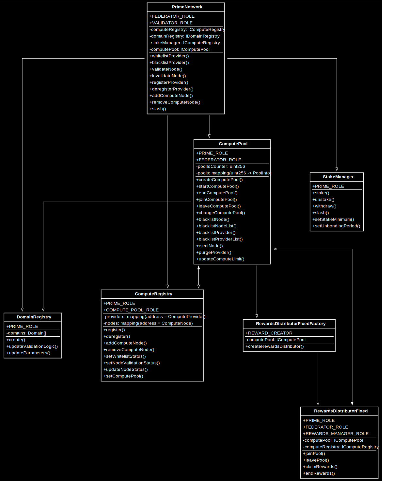

# Prime Network Protocol

Prime Network is a protocol for decentralized, incentivized compute orchestration. The compute resources across multiple providers are organized under various “domains” (logical groupings of compute workloads), and within each domain are compute pools that are allocating compute to a specific effort (e.g., distributed synthetic data generation run, large transformer model training run, etc). Staking (with slashing) and rewards for provided compute are used to manage cryptoeconomic incentives.

## Table of Contents

1. [Overview](#overview)  
2. [Core Contracts](#core-contracts)  
3. [Flow of Interactions](#flow-of-interactions)  
4. [Installation and Build Instructions](#installation-and-build-instructions)  

---

## Overview

- **Decentralized Providers and Nodes**: In the protocol, individual **Providers** stake to register their computing resources (represented by **Nodes**) in the network.  
- **Roles**:  
  - **Federator**: Can set high-level parameters and create “domains.”  
  - **Validator**: Maintains the quality of the network by whitelisting and validating providers/nodes and their work.
  - **Provider**: Supplies compute resources by staking and adding nodes.  
- **Domains**: Group compute tasks or workloads within a logical boundary. Each domain may have specialized validation logic and operational parameters.  
- **Compute Pools**: Aggregates nodes from various providers for specific tasks, tracks active node time intervals, and calculates rewards.

---

## Core Contracts




### 1. PrimeNetwork (coordinator contract)
- **Role Management**: Implements `FEDERATOR_ROLE` and `VALIDATOR_ROLE` for controlling who can create domains, whitelist providers, etc.  
- **Registration**: Providers can register with a stake, and compute nodes can be added with a valid signature.  
- **Domain Creation**: Federator can create domains in DomainRegistry.  

### 2. StakeManager
- **Locking & Unbonding**: When providers stake, the stake is held until the unbonding period completes.  
- **Slashing**: Provides a mechanism to penalize malicious stakers by partially or fully removing their stake.  

### 3. ComputeRegistry
- **Provider/Node Records**: Keeps details about providers (e.g., whitelisted status) and their nodes (compute capacity, active/inactive state, validation, etc.).  
- **Node Status Updates**: Works in tandem with ComputePool when nodes join or leave a pool.  

### 4. DomainRegistry
- **Domain Metadata**: Each domain has a unique ID, name, validation logic, and optional parameters URI.  
- **Management**: Allows the Federator role to update domain parameters or validation logic as needed.  

### 5. ComputePool
- **Pool Lifecycle**: Pools can be created (linked to a domain), started, and ended.  
- **Node Work Tracking**: Maintains join/leave records for each node, enabling reward distribution to be computed.  
- **Blacklisting**: Pool creators can remove or blacklist providers/nodes if necessary.  

### 6. RewardsDistributor
- **Reward Calculation**: Based on each node’s active time in a compute pool, multiplied by a configured reward rate.  
- **Claiming**: Providers (on behalf of their nodes) can claim their accrued rewards.   

---

## Flow of Interactions

```mermaid
sequenceDiagram
    autonumber
    participant F as Federator
    participant V as Validator
    participant P as Provider
    participant PC as PoolCreator
    participant PN as PrimeNetwork
    participant CR as ComputeRegistry
    participant SM as StakeManager
    participant DR as DomainRegistry
    participant CP as ComputePool
    participant RD as RewardsDistributor

    rect rgb(140, 100, 66)
    Note over F: (1) Federator sets up modules
    F->>PN: deploy modules  + set min stake + set validator
    end

    rect rgb(0, 0, 120)
    Note over P: (2-4) Provider registers
    P->>PN: registerProvider(stakeAmount)
    PN->>CR: register(provider)
    PN->>SM: stake(provider, stakeAmount)

    Note over P: (5-6) Provider adds compute node
    P->>PN: addComputeNode(nodeKey, specsURI, computeUnits, signature)
    PN->>CR: addComputeNode(...)
    end

    rect rgb(0, 120, 0)
    Note over V: (7-8) Validator whitelists & validates
    V->>PN: whitelistProvider(provider) // validateNode(provider, nodeKey)
    PN->>CR: setWhitelistStatus(...) <br/> setNodeValidationStatus(...)
    end

    rect rgb(140, 100, 66)
    Note over F: (9-10) Federator creates a domain
    F->>PN: createDomain(domainName, validationLogic, domainURI)
    PN->>DR: create(...)
    end

    rect rgb(120, 0, 0)
    Note over PC: (11-14) Pool creation
    PC->>CP: createComputePool(domainId, managerKey, poolName, poolDataURI)
    CP->>CP: poolId = <new>
    PC->>CP: startComputePool(poolId)
    CP->>RD: <new> distributor <br /> (contract creation)
    end
    rect rgb(80, 0, 80)
    loop Active ComputePool
    Note over P: (15-17) Provider adds node to pool using invite from PoolCreator
    PC-->>P: signInvite(domainId, poolId, nodekey) <br /> (offchain message)
    P->>CP: joinComputePool(poolId, provider, [nodeKey], [signatureInvite])
    CP->>CR: updateNodeStatus(provider, nodeKey, true) (set active)
    Note over PC: (18-19) PoolCreator can blacklist bad nodes/providers
    PC->>CP: blacklistNode(poolId, nodekey) // blacklistProvider(poolId, provider)
    CP->>CR: updateNodeStatus(provider, nodeKey, false) (set inactive)
    end
    end

    rect rgb(0, 0, 120)
    Note over P: (20-24) Provider removes nodes, claims reward and deregisters
    P->>CP: leaveComputePool(poolId, provider, nodeKey)
    CP->>CR: updateNodeStatus(provider, nodeKey, false) (set inactive)
    P->>RD: claimRewards()
    P->>PN: deregister()
    PN->>SM: unstake(provider)

    Note over P: (25) After unbonding period, provider can withdraw stake
    P->>SM: withdraw()
    end
```



A typical usage flow might look like this:

1. **Federator** deploys or configures all module contracts: `PrimeNetwork`, `ComputeRegistry`, `StakeManager`, `DomainRegistry`, `ComputePool`, etc.  
2. **Federator** sets a minimum stake requirement in `PrimeNetwork`.  
3. **Provider** stakes and registers via `PrimeNetwork`.  
4. **Provider** adds compute nodes, which are then validated/whitelisted by a **Validator**.  
5. **Federator** creates a new domain in `DomainRegistry`.  
6. **Provider** (acting as a participant) creates a `ComputePool` and invites nodes to join.  
7. **Provider** can leave a pool (or be blacklisted) at any time, triggering node status updates in `ComputeRegistry`.  
8. **RewardsDistributor** calculates and disperses rewards to providers for the compute time they contributed.

---

## Installation and Build Instructions

### Install
```shell
curl -L https://foundry.paradigm.xyz | bash
foundryup
```

### Build

```shell
forge build --via-ir
```

### Test

```shell
forge test --via-ir -vvv
```

### Run Locally

```shell
# start a local chain
anvil

# in a new terminal
./deploy.sh
```
