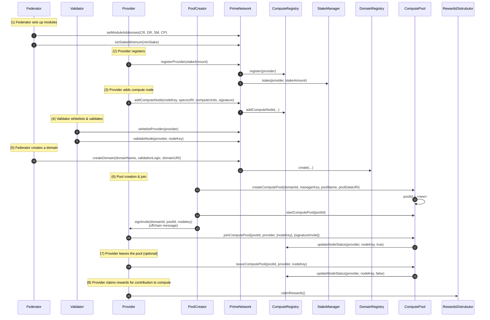

# Prime Network Protocol

Prime Network is a protocol for decentralized, incentivized compute orchestration. The compute resources across multiple providers are organized under various “domains” (logical groupings of compute workloads). The AI ERC20 token is used for staking, rewards, and to manage cryptoeconomic incentives.

## Table of Contents

1. [Overview](#overview)  
2. [Key Components](#key-components)  
3. [Core Contracts](#core-contracts)  
4. [Flow of Interactions](#flow-of-interactions)  
5. [Installation and Build Instructions](#installation-and-build-instructions)  
6. [Testing](#testing)  

---

## Overview

- **Decentralized Providers and Nodes**: In the protocol, individual **Providers** stake tokens to register their computing resources (represented by **Nodes**) in the network.  
- **Roles**:  
  - **Federator**: Can set high-level parameters and create “domains.”  
  - **Validator**: Maintains the quality of the network by whitelisting and validating providers/nodes.  
  - **Provider**: Supplies compute resources by staking AI tokens and adding nodes.  
- **Domains**: Group compute tasks or workloads within a logical boundary. Each domain may have specialized validation logic and operational parameters.  
- **Compute Pools**: Aggregates nodes from various providers for specific tasks, tracks active node time intervals, and calculates rewards.

---

## Key Components

1. **AIToken**: An ERC20 token that serves as the native currency for staking and rewarding compute work.  
2. **PrimeNetwork**: The central coordination contract, which:
   - Enforces roles and permissions (Federator, Validator).  
   - Handles the registration of providers and their stakes.  
   - Orchestrates the creation of domains and links them to the DomainRegistry.  
3. **StakeManager**: Manages all staking-related logic, including unbonding periods, slashing conditions, and minimum stake requirements.  
4. **ComputeRegistry**: Maintains the record of providers, nodes, and their status (e.g., whitelisted, validated, active).  
5. **DomainRegistry**: Keeps track of various domains, each referencing potential validation logic and metadata.  
6. **ComputePool**: Governs the lifecycle of compute pools, from creation to completion. Tracks which nodes join, their active time intervals, and overall compute capacity.  
7. **RewardsDistributor**: Calculates rewards for nodes based on active time in a compute pool and distributes tokens accordingly.

---

## Core Contracts

### 1. PrimeNetwork
- **Role Management**: Implements `FEDERATOR_ROLE` and `VALIDATOR_ROLE` for controlling who can create domains, whitelist providers, etc.  
- **Registration**: Providers can register with a stake, and compute nodes can be added with a valid signature.  
- **Domain Creation**: Federator can create domains in DomainRegistry.  

### 2. StakeManager
- **Token Locking & Unbonding**: When providers stake tokens, those tokens are held until the unbonding period completes.  
- **Slashing**: Provides a mechanism to penalize malicious stakers by partially or fully removing their staked tokens.  

### 3. ComputeRegistry
- **Provider/Node Records**: Keeps details about providers (e.g., whitelisted status) and their nodes (compute capacity, active/inactive state, validation, etc.).  
- **Node Status Updates**: Works in tandem with ComputePool when nodes join or leave a pool.  

### 4. DomainRegistry
- **Domain Metadata**: Each domain has a unique ID, name, validation logic, and optional parameters URI.  
- **Management**: Allows the Federator role to update domain parameters or validation logic as needed.  

### 5. ComputePool
- **Pool Lifecycle**: Pools can be created (linked to a domain), started, and ended.  
- **Node Work Tracking**: Maintains join/leave timestamps for each node, enabling reward distribution to be computed.  
- **Blacklisting**: Pool creators can remove or blacklist providers/nodes if necessary.  

### 6. RewardsDistributor
- **Reward Calculation**: Based on each node’s active time in a compute pool, multiplied by a configured reward rate.  
- **Claiming**: Providers (on behalf of their nodes) can claim their accrued rewards.  

### 7. AIToken (ERC20)
- **Minting & Burning**: Controlled by roles in the token contract.  
- **Staking Currency**: Used across Prime Network for staking, rewards, and slashing.  

---

## Flow of Interactions

A typical usage flow might look like this:

1. **Federator** deploys or configures all module contracts: `PrimeNetwork`, `ComputeRegistry`, `StakeManager`, `DomainRegistry`, `ComputePool`, etc.  
2. **Federator** sets a minimum stake requirement in `PrimeNetwork`.  
3. **Provider** stakes AI tokens and registers via `PrimeNetwork`.  
4. **Provider** adds compute nodes, which are then validated/whitelisted by a **Validator**.  
5. **Federator** creates a new domain in `DomainRegistry`.  
6. **Provider** (acting as a pool creator or participant) creates a `ComputePool` and invites nodes to join.  
7. **Provider** can leave a pool (or be blacklisted) at any time, triggering node status updates in `ComputeRegistry`.  
8. **RewardsDistributor** calculates and disperses rewards to providers for the compute time they contributed.



---

## Installation and Build Instructions

### Install
```shell
curl -L https://foundry.paradigm.xyz | bash
foundryup
```

### Build

```shell
forge build --via-ir
```

### Test

```shell
forge test --via-ir -vvv
```

### Run Locally

```shell
# start a local chain
anvil

# in a new terminal
./deploy.sh
```
